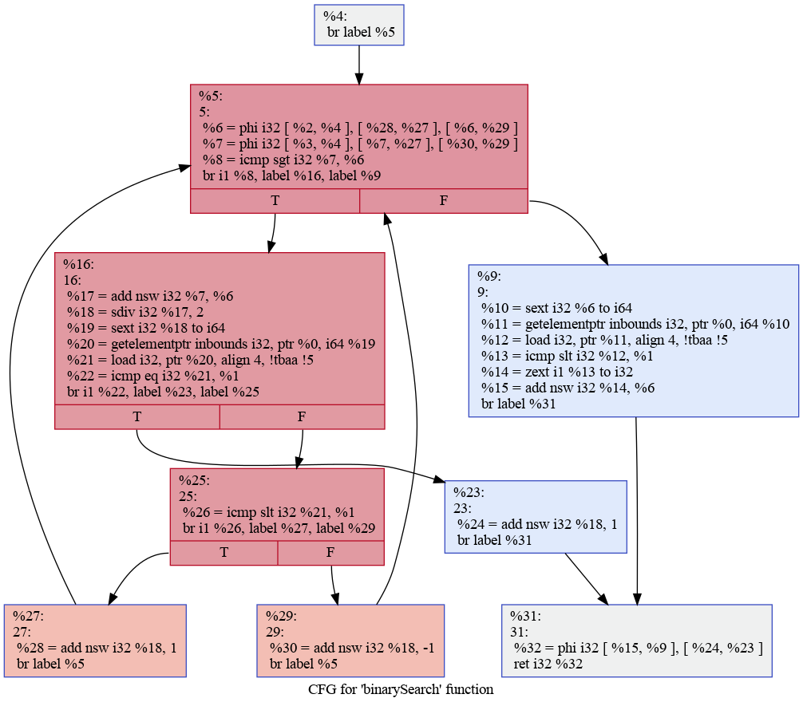

## 优化算法介绍

下面是部分优化算法的示例和原理介绍。由于篇幅原因无法将每个算法的原理进行详细介绍，此处仅提供算法实现的效果展示和简单的原理说明，同学可以通过其他方式自行搜索相关算法的原理和实现方法，或者参考LLVM github仓库的[优化实现](https://github.com/llvm/llvm-project/tree/main/llvm/include/llvm/Transforms)学习算法原理。

面向本实验提供的性能测例，我们给出一种综合考虑性能提升与实现难度的优化顺序：`强度削弱 -> mem2reg -> 公共子表达式消除 -> 死代码/存储消除 -> 循环无关变量移动 -> 函数内联 -> 循环展开 -> ...`。同学们也可以根据自己对优化原理的理解和对测例的分析结果，调整上述优化顺序。

### 数据流优化

数据流优化通过分析程序中数据的传递和使用方式改进程序性能，主要涉及LLVM IR的use-def链的使用。use-def链描述LLVM IR中变量定义与使用的关系，若变量`x`在`y`的计算中被使用，则存在一条use从`y`指向`x`，表示在`y`的定义时需要使用到`x`。use-def链能够表示变量之间的依赖关系，在数据流分析中起着至关重要的作用。

```C++
int c = a + b;

// 两条use：%add->%0 和 %add->%1
%0 = load i32, ptr %a, align 4
%1 = load i32, ptr %b, align 4
%add = add nsw i32 %0, %1
```

上面的例子展示了一条加法指令中的use-def链。由于加法指令`%add`的定义使用了`%0`和`%1`，因此指令`%0`和`%1`作为`%add`的操作数（operand）可以被`%add`通过use-def链搜索得到。

#### 常量传播&常量折叠

代表测例：`bitset-*.sysu.c`、`fft-*.sysu.c`、`if-combine*.sysu.c`

难度：&#9733;&#9734;&#9734;&#9734;&#9734;

常量传播（Constant Propagation）与常量折叠（Constant Folding）是最常见的常量优化方式，其原理为在编译阶段尽可能减少常量的计算与存储。两者的区别为：

* 常量传播直接用常量替代变量，减少程序的存储和访存开销
* 常量折叠直接将编译阶段能够计算的常量表达式计算出结果，减少程序运行时的计算量

下面是一个简单的例子：

```C++
// 优化前
const int a = 1, b = 2;
int c = a + b;

// 常量传播
int c = 1 + 2;

// 常量折叠
int c = 3;
```

基于LLVM提供的use-def链，可以很简单地获取使用到某个变量的指令，因此只需要将常变量`const int`的操作数直接替换为常量即可。对于赋初值但未被修改的`int`类型变量，也可以进行上述替换。除此之外，常量传播与常量折叠可以在语法分析和语义分析阶段完成，即把生成`const int`的子图直接替换为`Constant`节点，感兴趣的同学可以了解与实现。

#### 死代码消除

代表测例：

难度：&#9733;&#9733;&#9733;&#9734;&#9734;

死代码消除（Dead Code Elimination，DCE）是一种将对全局变量、输出和返回结果无影响（无副作用）的指令删除的优化。对于一个程序而言，满足以上条件的指令我们认为它在进行一些无意义的计算，其计算结果对于外界来说是不可感知的，因此即使删除也不会对程序的结果产生影响。下面是一个简单的例子：

```C++
// 优化前
int main() {
  int sum = 0;
  int j = 0;
  for(int i = 0; i < 10; i ++) sum += i;
  ...
  print(j);
  return 0;
}

// 优化后
int main() {
  int j = 0;
  print(j);
  return 0;
}
```

激进的DCE（Aggresive Dead Code Elimination，ADCE）可以通过遍历返回值、输出指令等对外界可能产生影响的指令的use-def链来找出所有需要保留的指令，对于不在该链上的所有指令可以删除。上述方法比较激进，有时候可能会产生错误，我们也难以判断一个变量是否可能对外界产生影响（例如函数调用等），因此我们一般使用普通的DCE进行优化。

对于DCE，我们可以遍历每条指令的use-def链，如果该use-def链上所有端点都没有被使用（即端点的use次数为0），且链中无函数调用与访存，说明该链上的所有计算结果都是无效计算，应该被删除。更高效的方法是对于中间存在函数调用的use-def链，判断该函数是否有副作用（对外界产生影响）。若函数无副作用，则能够继续进行上述use-def链遍历。这种能够扩大DCE的覆盖范围，提供更大的优化空间。

#### 公共子表达式消除

代表测例：`hoist-*.sysu.c`

难度：&#9733;&#9733;&#9734;&#9734;&#9734;

公共子表达式消除（Common Subexpression Elimination，CSE）是一个非常经典的优化算法，如果一个表达式E在计算得到后没有变化，且同时作为多条指令的操作数被使用，那么E能够被称为公共子表达式：

```C++
// (a + b)是d和e的公共子表达式
int d = a + b - c;
int e = a + b + c;

// CSE优化后
int tmp = a + b;
int d = tmp - c;
int e = tmp + c;
```

CSE的优化原理是比较简单的，本质上就是复用之前已经计算得到的结果，避免重复计算。根据CSE的原理可以引出两个问题：

1. 如何判断一个表达式E是否是公共子表达式？
2. 如何判断一个表达式E的值在计算后没有变化?

对于上述两个问题，LLVM IR的设计能够为我们提供很大的帮助。我们知道LLVM IR本质上满足静态单赋值（Static Single Assignment，SSA），即对于编号相同的操作数，我们能够保证它们一定相等。那么上述两个问题可以通过以下方法判断，对于某条指令`%3 = bin_op %1, %2`：

1. 对该指令后的某条指令`%6 = bin_op %4, %5`，判断操作数`%4, %5`与`%1, %2`是否相同。若操作数相同（即`%6 = bin_op %1, %2`），则`%3`与`%6`一定相同，那么所有操作数为`%6`的指令都可以使用`%3`替代，同时`%6`也无需计算，能够删除该指令。
2. 对于访存相关的指令，我们难以直接判断相同内存地址的值在不同时间是否相同，判断需要增加访存分析，一般这样的指令我们可以保守地选择不删除。对于单个变量的访存分析相对简单，在LLVM IR层面可以对非数组变量的冗余load、store指令进行消除，例如判断load指令的use数量是否为0（load的结果没有被使用到）。

CSE可以通过简单的搜索实现：对于每一条可能为公共子表达式的指令`%3`，遍历其后面一定数量 k 的指令`%6`，判断当前指令与后续指令是否计算相同的内容。不难证明其时间复杂度为 O(kN) ，其中 N 为指令总数。指令`%3`和`%6`之间的间隔（即指令窗口大小 $k$ ）可以自行定义，间隔的大小决定了优化的范围。间隔越大，判断公共子表达式的范围越大，优化效果越好，但相应地编译时间也会延长。更高效的方法是使用全局值编号（Global Value Number，GVN）寻找公共子表达式，该算法在此不作介绍，同学们感兴趣可以自行查找资料。

#### 指令合并

代表测例：`instruction-combining-*.sysu.c`

难度：&#9733;&#9733;&#9733;&#9734;&#9734;

指令合并（Instruction Combining）是一种将多条指令合并成一条指令的优化方式。下面是一个简单的例子：

```C++
// 指令合并前（假设b变量只在c的计算中用到）
int b = a + 1;
int c = b + 1;

// 指令合并后
int c = a + 2;
```

对于算术运算而言，指令合并的前提是存在一条类似于链表的use-def链，链的尾部可以直接由链的头部计算得到，中间计算结果在删除后不影响其他指令的计算。在LLVM的实现中，指令合并前会利用算术规则调整指令形式（例如对于满足交换律的计算统一将变量作为左操作数，常数作为右操作数等），提供更多的指令合并机会。

### 控制流优化

控制流优化通过分析代码块的跳转、分支、循环等结构来改进程序性能。


#### 支配树算法

支配树算法是一种对有向图结构的分析算法，分析图中各节点的支配关系，在编译器优化领域为其他优化提供重要信息。

完整的支配树算法较为复杂，同学们可以直接调用API来构建支配树，或者查看相关资料。有暴力求解的算法也有[Lengauer–Tarjan 算法](https://www.cs.princeton.edu/courses/archive/fall03/cs528/handouts/a%20fast%20algorithm%20for%20finding.pdf)。[这个链接](https://oi-wiki.org/graph/dominator-tree/)里有详细的介绍，感兴趣的同学可以自行学习。

#### 循环无关变量移动

#### 循环展开

代表测例：`bitset*.sysu.c`、`crypto-*.sysu.c`、`instruction-combining-*.sysu.c`、`integer-divide-optimization-*.sysu.c`

难度：&#9733;&#9733;&#9733;&#9733;&#9734;

仅介绍循环次数为常数、可完全展开的循环展开。

基本的思路如下：

```C++
//  循环展开前
while(j<60)
{
  ans = ans + 20;
}

// 循环展开后
ans = ans + 20;
ans = ans + 20;
...
ans = ans + 20;

// 结合后续优化
ans = ans + 20 * 60;
```
循环展开的作用不仅仅是将原本常数的循环展开成非常数的循环，更是要结合后续优化，让循环内的语句能被后续的pass进一步优化。

#### 控制流简化

代表测例：所有performance测例

难度：&#9733;&#9733;&#9734;&#9734;&#9734;


控制流图(CFG)反映了基本块之间的关系，每个基本块都只有一个进入点(到达某个基本块时，一定是从基本块的第一条指令开始执行)和一个退出点(ret或br指令)，且这些br指令会指明其将会跳转到哪个基本块(1或2个目标基本块)，使用有向边将这些可能的跳转连接起来就构成了程序的控制流图。

同学们可以直接调用Analysi Pass来构建控制流图(API 见文档)，也可以自己手写一个，只需要从entry basic block开始遍历所有基本块，将br指令的边添加到图中即可。

同学们可以使用[指令](https://wisesciencewise.wordpress.com/2022/10/03/steps-to-generate-llvm-call-flow-graphcfg/)来可视化查看当前IR的控制流图，其中第三行语句可以使用在线工具显示
```
clang -S -emit-llvm file.c -o file.ll
opt -dot-cfg -disable-output -enable-new-pm=0 file.ll
dot -Tpng -ofunction.png .function.dot
```

可以看到控制流图


控制流简化即对控制流图进行简化，同学们观察IR时，可能会发现一些basic block是不可达的，或者一些basic block中只有一条return指令，为了执行这条指令，需要一次额外的跳转，需要花费更多时间。

同时，有很多其他优化会局限在一个基本块内，因此通过合并较小的基本块，构造更大的基本块，将会创建更多优化机会。(也可以通过调整基本块的顺序来获得更好的layout，但这不属于控制流优化了)

最为简单的控制流图简化即分析可以合并的基本块模式并将其合并，首先是可以删除不可达的基本块，然后是如果一个基本块的前缀基本块唯一，即只有一个基本块可以到达这个基本块，且该前缀基本块的后缀唯一，即该前缀基本块只会跳转到该基本块，则可以将这两个基本块合并，并删除跳转指令。如果多个块跳转到同一个块，且跳转的目标块以ret结尾，则可以考虑将目标块拷贝多份与前缀块进行合并，注意，这种合并未必是有利的。其余更多的模式同学们可以查阅资料或者自己思考。

### 指令级优化

指令级优化主要包括指令调度、指令选择等内容，将单条或多条指令转化为运行效率更高的指令。

#### mem2reg

代表测例：所有performance测例

难度：&#9733;&#9733;&#9733;&#9733;&#9734;

mem2reg优化是其他所有优化的基础，其为其他优化提供了更大的空间。**同学们应该优先完成该优化**。

在理论课上，各位同学应该了解过静态单赋值(SSA)形式，即每个变量只会被赋值一次。完成实验三的同学们，如果认真阅读过LLVM IR的话，应该会发现在IR中，每个寄存器都只会被赋值一次，满足SSA形式，但是并不是每个变量都只会被赋值一次，每个被alloca出来的地址，可能会被多次赋值，这就不保证SSA形式了。即IR通过一些额外的空间来使得寄存器达到SSA形式。而这些额外的空间并不是必要的，即我们可以达到更完整的SSA形式。这就是mem2reg完成的工作
如以下[例子](https://mapping-high-level-constructs-to-llvm-ir.readthedocs.io/en/latest/control-structures/ssa-phi.html)
```C++
int max(int a, int b) {
  if (a > b) {
    return a;
  } else {
    return b;
  }
}
```
我们有IR如下
```
define i32 @max(i32 %a, i32 %b) #0 {
entry:
  %retval = alloca i32, align 4
  %a.addr = alloca i32, align 4
  %b.addr = alloca i32, align 4
  store i32 %a, i32* %a.addr, align 4
  store i32 %b, i32* %b.addr, align 4
  %0 = load i32, i32* %a.addr, align 4
  %1 = load i32, i32* %b.addr, align 4
  %cmp = icmp sgt i32 %0, %1
  br i1 %cmp, label %if.then, label %if.else

if.then:                                          ; preds = %entry
  %2 = load i32, i32* %a.addr, align 4
  store i32 %2, i32* %retval, align 4
  br label %return

if.else:                                          ; preds = %entry
  %3 = load i32, i32* %b.addr, align 4
  store i32 %3, i32* %retval, align 4
  br label %return

return:                                           ; preds = %if.else, %if.then
  %4 = load i32, i32* %retval, align 4
  ret i32 %4
}
```
我们可以将其转换为如下IR(这个不是标准的LLVM IR，仅用来解释中间过程)
```
define i32 @max(i32 %a, i32 %b) {
entry:
  %0 = icmp sgt i32 %a, %b
  br i1 %0, label %if.then, label %if.else

if.then:
  %retval = %a
  br label %return

if.else:
  %retval = %b
  br label %return

return:
  ret i32 %retval
}
```
此时，可以发现我们删除了局部变量，这将节省大量运行时间(这里没有举局部数组的例子，因为想要去除数组，需要复杂的数据流分析，有兴趣的同学可以自己去了解，通常mem2reg优化也不会处理数组相关的变量)，但是寄存器不再是静态单赋值的了，这时候我们需要对寄存器重命名，并添加一条新指令，PHI指令(注意，PHI指令只能位于基本块的开头，即PHI指令前只能是PHI指令)。phi指令的值取决于我们从哪个基本块跳转到该基本块，如果前缀块是if.then，则其值为retval1，否则，其值为retval2
```
define i32 @max(i32 %a, i32 %b) {
entry:
  %0 = icmp sgt i32 %a, %b
  br i1 %0, label %if.then, label %if.else

if.then:
  %retval1 = %a
  br label %return

if.else:
  %retval2 = %b
  br label %return

return:
  %retval = phi i32 [%retval1, %if.then], [%retval2, %if.else]
  ret i32 %retval
}
```
当然，LLVM中并没有%retval1 = %a这样的语句，因此实际上，我们将获得以下结果
```
define i32 @max(i32 %a, i32 %b) {
entry:
  %0 = icmp sgt i32 %a, %b
  br i1 %0, label %if.then, label %if.else

if.then:
  br label %return

if.else:
  br label %return

return:
  %retval = phi i32 [%a, %if.then], [%b, %if.else]
  ret i32 %retval
}
```
而此时，我们就可以用其他优化方法对该IR进行更进一步的优化，比如控制流简化可以将return基本块与其之前的基本块融合。

从刚刚的例子，同学们应该能了解到mem2reg的基本流程，删除alloca，寄存器重命名，以及插入PHI指令，实际上在这之前还有一步，就是构建支配树，因为mem2reg优化过程中需要使用支配树，所以在开始mem2reg前，需要先使用API构建好支配树。在构建好支配树后，我们就可以开始进行mem2reg优化。[参考资料](https://buaa-se-compiling.github.io/miniSysY-tutorial/challenge/mem2reg/help.html)


#### 强度削弱

代表测例：`bitset*.sysu.c`、`crypto-*.sysu,c`

难度：&#9733;&#9734;&#9734;&#9734;&#9734;

强度削弱（Strength Reduction）将一条高计算复杂度的指令，转化为一条或多条低复杂度的指令。强度削弱是一个很简单但非常有效的优化方式，因为这样的优化机会广泛存在于我们编写的程序之中。在算法比赛中我们常常在编程时使用到这些技巧，但编译器使得我们无需为了性能小心翼翼地编程而获得高性能的程序。下面是一些直观的例子：

```C++
// 优化前
int a = x * 8, b = x % 4, c = x * 3;

// 优化后
int a = x << 3, b = x & 0b11, c = (x << 1) + x;
```

实现方法很简单，只需要识别出上述计算模式（例如对于乘法直接判断左右操作数是否为2的幂）即可直接进行指令和操作数的替换。大家可以进一步思考，除法是否能够进行类似的优化？如果可以，需要满足什么条件？

#### 代数恒等式

代表测例：

难度：&#9733;&#9734;&#9734;&#9734;&#9734;

代数恒等式（Algebraic Identities）通过数学规则消除无意义的数学运算，提前将结果算出。例如：

```C++
int a = x + 0, b = x - 0;
int c = x * 1, d = x / 1;
int e = x * 0, f = x % 1;
```

方法也很简单，只需要识别出上述计算模式（例如对于加法直接判断左右操作数是否为0）即可直接进行结果的计算与替换。

### 模块级优化

模块级优化主要寻求跨函数的优化机会。

#### 函数内联

代表测例：所有performance测例

难度：&#9733;&#9733;&#9733;&#9733;&#9734;

待补充

### 访存优化

访存优化通过分析程序的访存模式，消除非必要的访存指令，并提升访存行为的局部性。

#### 死存储消除

代表测例：`dead-code-elimination-*.sysu.c`

难度：&#9733;&#9733;&#9734;&#9734;&#9734;

死存储消除（Dead Storage Elimination，DSE）与DCE相同，都是将无意义的代码识别并删除，两者本质上是同一种优化算法。不同的是前者主要针对变量初始化、访存指令的消除，而后者主要针对计算指令的消除。对于一个定义了但并未对输出、返回值和全局变量产生影响的变量，其定义、访存指令可以全部删除。

```C++
// 优化前
int main() {
  int a = 0;
  int b = 1;
  a = a + 2;
  return b;
}

// 优化后
int main() {
  int b = 1;
  return b;
}
```

实现方法与[DCE](#死代码消除)相同，在此不作赘述。

### 高级优化

#### 自动向量化

代表测例：`mm*.sysu.c`

难度：&#9733;&#9733;&#9733;&#9733;&#9733;

包括向量化内存访问与向量化计算。

#### 自动并行

代表测例：`mm*.sysu.c`

难度：&#9733;&#9733;&#9733;&#9733;&#9733;

自动识别可以并行执行的代码块，并将部分代码由串行执行优化为并行执行，充分利用CPU的计算资源。
